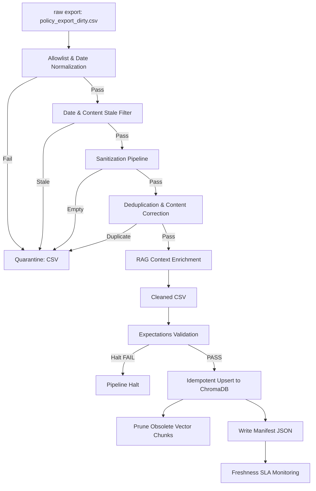

# Kiến trúc pipeline — Lab Day 10

**Nhóm:** Blue Team  
**Cập nhật:** 2026-06-10

---

## 1. Sơ đồ luồng (bắt buộc có 1 diagram: Mermaid / ASCII)

*   **Freshness**: Đo tại mốc `freshness_check` dựa vào `latest_exported_at` thu được từ file manifest.
*   **Run ID**: Sinh tự động bằng định dạng timestamp UTC `%Y-%m-%dT%H-%MZ` hoặc truyền vào thông qua đối số command line.
*   **Quarantine**: Ghi nhận lý do lỗi vào cột `reason` và xuất ra `artifacts/quarantine/`.

---

## 2. Ranh giới trách nhiệm

| Thành phần | Input | Output | Owner nhóm |
|------------|-------|--------|--------------|
| Ingest | `policy_export_dirty.csv` | Dict rows thô | Nguyễn Văn A |
| Transform | Dict rows thô | Cleaned rows & Quarantine rows | Trần Thị B |
| Quality | Cleaned rows | Expectation results & Halt flag | Trần Thị B |
| Embed | Cleaned rows | Chroma collection updates | Lê Văn C |
| Monitor | Manifest JSON | Freshness SLA status | Phạm Văn D |

---

## 3. Idempotency & rerun

*   **Idempotency Strategy**: Upsert dựa trên `chunk_id` ổn định được tạo từ hàm hash SHA-256: `hash(doc_id | chunk_text | seq)[:16]`. 
*   **Obsolete Pruning**: Trước khi nhúng, pipeline thực hiện truy vấn tất cả các `ids` hiện có trong ChromaDB collection. Sau đó, so sánh với danh sách `ids` mới của run hiện tại và thực hiện lệnh xóa các vector cũ bị thừa (`col.delete(ids=drop)`).
*   **Rerun**: Rerun pipeline 2 lần liên tục với cùng tập dữ liệu hoàn toàn không gây trùng lặp hay phát sinh vector thừa nhờ cơ chế upsert idempotent kết hợp pruning.

---

## 4. Liên hệ Day 09

Pipeline này đóng vai trò cung cấp dữ liệu sạch cho cơ sở dữ liệu tri thức dùng chung (`day10_kb`). Collection này sẽ được Agent của Day 09 sử dụng làm corpus chính để tra cứu thông tin hỗ trợ sự cố IT, chính sách nhân sự và quy trình hoàn trả tiền. Việc bổ sung RAG Context Enrichment đảm bảo độ chính xác truy xuất cao nhất cho Agent.

---

## 5. Rủi ro đã biết

*   **SLA trễ hạn**: Khi nguồn dữ liệu không có cập nhật mới trong 24 giờ, freshness check sẽ báo lỗi quá hạn ngay cả khi dữ liệu vẫn sạch.
*   **Ký tự Unicode phức tạp**: Một số từ viết tắt hoặc ký tự Unicode đặc biệt có thể làm sai lệch ranh giới tách câu của regex nếu không có khoảng trắng theo sau.
